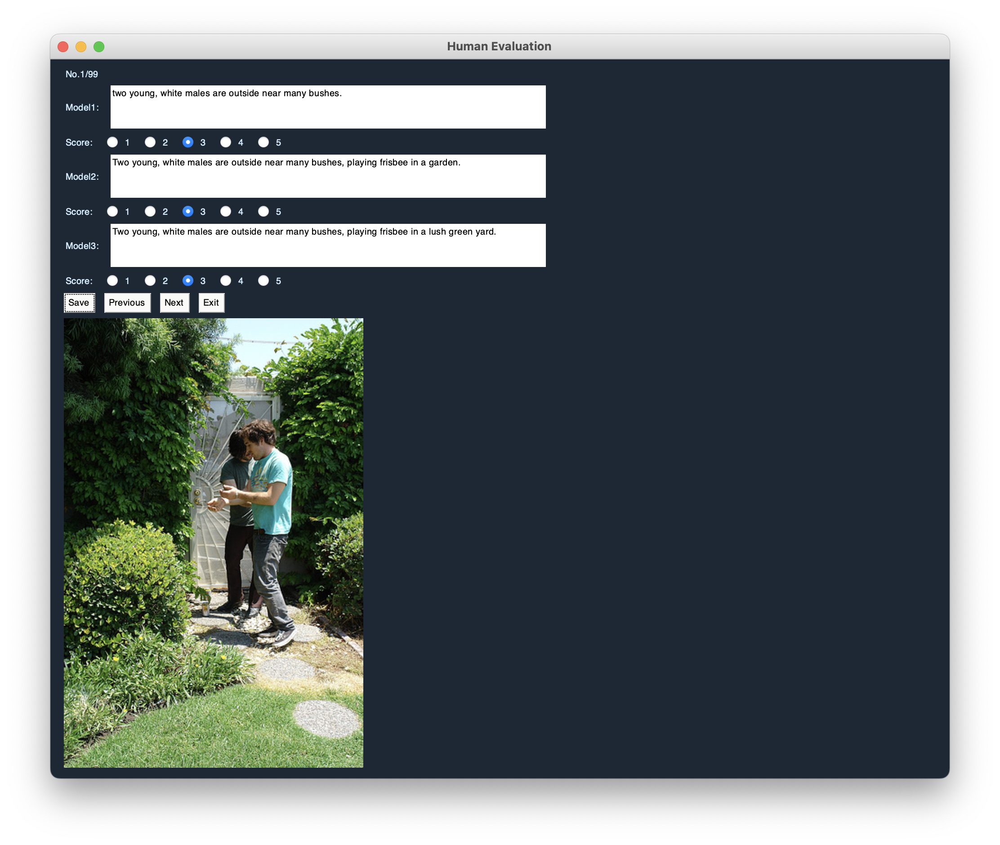

# img-descr-human-eval
image description human evaluation

Five-Point Scales (1-5 points):
- Much better
- Somewhat better
- Stayed the same
- Somewhat worse
- Much worse



## 食用说明

Requirements:
```
python==3.7.2
numpy==1.17.2
pandas==1.0.5
PySimpleGUI==4.60.4
```

Run:
```shell
$ python main.py
```
输入、输出文件名均在`main.py`中，可自定义

